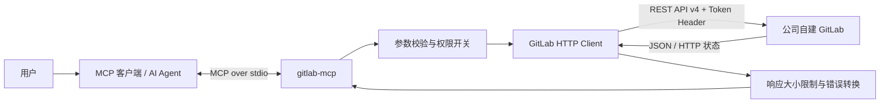
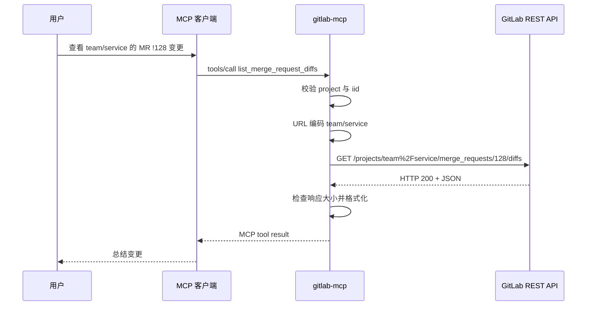

# GitLab MCP 方案设计

## 1. 背景

公司研发信息集中在内部自建 GitLab 中。通用大模型客户端无法直接、安全地查询私有项目，人工复制项目、MR、Issue 和 Pipeline 信息又会造成上下文缺失和重复操作。

本方案提供一个运行在开发者本机的 MCP Server，把一组经过约束的 GitLab REST API 能力暴露为结构化工具，使 MCP 客户端可以在用户授权范围内读取研发信息，并按需执行低风险写操作。

## 2. 目标与非目标

### 2.1 目标

- 支持自建 GitLab 实例，而不是绑定 GitLab.com。
- 覆盖项目检索、MR 评审、Issue 跟踪、代码读取和 CI 排查等高频流程。
- 使用 MCP 标准协议，让不同 MCP 客户端可以复用。
- 凭据不进入源码、命令行参数和工具返回结果。
- 写操作显式开启，保持默认只读。
- 对分页、响应大小、TLS 和错误信息建立清晰边界。

### 2.2 非目标

- 不替代 GitLab Web UI 或完整 GitLab API。
- 不提供管理员、用户、权限、Runner 等实例管理能力。
- 不提供合并 MR、删除分支/项目、修改仓库文件等高风险操作。
- 当前不提供远程 Streamable HTTP 服务、多用户会话或集中式 Token 托管。
- 当前不主动缓存 GitLab 数据，也不建立本地索引。

## 3. 总体架构



组件职责：

| 组件 | 职责 |
| --- | --- |
| MCP 客户端 | 启动本地进程、发现工具、根据用户意图调用工具、呈现调用参数和结果 |
| `GitLabMcp` | 注册工具、解析结构化参数、校验分页、执行写操作开关 |
| `GitLabClient` | 读取配置、构造认证 Header、调用 GitLab REST API、限制响应大小、转换错误 |
| GitLab | 执行最终鉴权和权限判断，返回项目数据或错误状态 |

## 4. 技术选型

### 4.1 Rust

选择 Rust 的原因：

- 可构建为单一二进制，便于本机部署；
- 内存和类型安全适合处理凭据、URL 和结构化协议；
- 与当前 `rs-tools` 仓库的工具栈一致；
- 异步运行时适合 MCP stdio 与 HTTP 请求。

### 4.2 MCP stdio

当前采用 stdio，而不是远程 HTTP：

- MCP 客户端直接拉起子进程，不需要额外监听端口；
- Token 只存在于本机子进程环境中；
- 不需要处理多租户身份、网络暴露、反向代理和服务端会话；
- 适合个人开发环境和首版落地。

代价是每位使用者都需要安装二进制并配置自己的 Token。若未来需要团队集中托管，再评估 Streamable HTTP、企业 OAuth 和服务端审计。

### 4.3 GitLab REST API v4

选择 REST v4 而不是 GraphQL：

- 自建 GitLab 各版本对这些 REST 资源的兼容性更成熟；
- 项目、MR、Issue、Repository、Pipeline、Note 均有直接对应端点；
- 请求与权限问题容易通过 GitLab 文档和 HTTP 状态排查。

### 4.4 定向工具，而非通用 API 代理

服务只暴露预定义端点，没有提供可输入任意 method/path/body 的 `gitlab_api` 工具。这样可以：

- 限制模型可调用的能力范围；
- 为参数生成准确 JSON Schema；
- 在服务端统一实现写开关、路径编码和分页约束；
- 避免通用代理绕过“不合并、不删除、不改文件”的安全边界。

## 5. 模块设计

### 5.1 入口层 `src/main.rs`

职责：

1. 从环境创建 `GitLabClient`；
2. 创建 `GitLabMcp`；
3. 通过 stdio 启动 MCP 服务；
4. 等待客户端关闭连接。

初始化配置失败时进程直接退出，并把不含 Token 的错误写到 stderr。stdout 专用于 MCP JSON-RPC 消息。

### 5.2 GitLab 客户端 `src/client.rs`

职责：

- 规范化 `GITLAB_URL`，自动补充 `/api/v4`；
- 根据 `GITLAB_TOKEN_TYPE` 生成认证 Header；
- 把 Token Header 标记为敏感值；
- 设置 30 秒 HTTP 超时；
- 可选支持自签名证书；
- 在解析前检查 `Content-Length`，解析后再次检查实际响应大小；
- 把非 2xx 响应转换为包含 HTTP 状态和 GitLab 错误正文的工具错误；
- 对项目路径和文件路径进行单路径段百分号编码。

### 5.3 工具层 `src/tools.rs`

职责：

- 通过 `rmcp` 宏注册工具并生成 JSON Schema；
- 把工具参数映射到 GitLab API 路径、查询参数和 JSON Body；
- 为 `review_merge_request_context` 并发聚合多个只读端点，并允许可选端点部分失败；
- 统一校验 `page >= 1` 和 `1 <= per_page <= 100`；
- 对写工具执行 `GITLAB_ALLOW_WRITE` 检查；
- 把 GitLab JSON 格式化为 MCP 文本内容；
- 把业务/API 错误标记为 MCP tool-level error。

## 6. 工具与 API 映射

| MCP 工具 | HTTP | GitLab API | 类型 |
| --- | --- | --- | --- |
| `get_current_user` | GET | `/user` | 读 |
| `list_projects` | GET | `/projects` | 读 |
| `get_project` | GET | `/projects/:id` | 读 |
| `list_merge_requests` | GET | `/projects/:id/merge_requests` | 读 |
| `get_merge_request` | GET | `/projects/:id/merge_requests/:iid` | 读 |
| `list_merge_request_diffs` | GET | `/projects/:id/merge_requests/:iid/diffs` | 读 |
| `review_merge_request_context` | GET（聚合） | MR、diffs、commits、discussions、related issues、pipelines、approvals | 读 |
| `list_issues` | GET | `/projects/:id/issues` | 读 |
| `get_issue` | GET | `/projects/:id/issues/:iid` | 读 |
| `list_repository_tree` | GET | `/projects/:id/repository/tree` | 读 |
| `get_repository_file` | GET | `/projects/:id/repository/files/:file_path` | 读 |
| `list_pipelines` | GET | `/projects/:id/pipelines` | 读 |
| `list_pipeline_jobs` | GET | `/projects/:id/pipelines/:pipeline_id/jobs` | 读 |
| `create_issue` | POST | `/projects/:id/issues` | 写 |
| `create_merge_request` | POST | `/projects/:id/merge_requests` | 写 |
| `add_issue_note` | POST | `/projects/:id/issues/:iid/notes` | 写 |
| `add_merge_request_note` | POST | `/projects/:id/merge_requests/:iid/notes` | 写 |

工具的完整参数定义和使用示例见 [README.md](./README.md#工具详情)。

## 7. 请求流程

以读取 MR diff 为例：



写工具在发出 HTTP 请求前增加一道开关校验：

```text
工具调用 → 参数解析 → GITLAB_ALLOW_WRITE 校验 → GitLab 权限校验 → 返回结果
                         └─ false：直接返回 tool-level error，不访问 GitLab
```

## 8. 配置模型

配置只从进程环境变量读取：

| 配置 | 设计说明 |
| --- | --- |
| `GITLAB_URL` | 支持实例根地址或完整 API v4 地址，适配带子路径部署的 GitLab |
| `GITLAB_TOKEN` | 必填，不写入日志和响应 |
| `GITLAB_TOKEN_TYPE` | 支持 Private、OAuth/Bearer、Job Token 三类 Header |
| `GITLAB_ALLOW_WRITE` | 服务端能力闸门，与 GitLab Token 权限形成双重限制 |
| `GITLAB_INSECURE` | 兼容遗留内网证书，但默认关闭 |
| `GITLAB_MAX_RESPONSE_BYTES` | 限制单次工具返回进入模型上下文的数据量 |

不直接读取 `.env` 或项目中的凭据文件，原因是 MCP 客户端已经具备环境注入能力，而且避免服务猜测凭据来源和文件格式。

## 9. 鉴权与权限

### 9.1 支持的 Token

| Token 类型 | `GITLAB_TOKEN_TYPE` | HTTP Header |
| --- | --- | --- |
| Personal/Project Access Token | `private` 或 `pat` | `PRIVATE-TOKEN: ...` |
| OAuth Access Token | `oauth` 或 `bearer` | `Authorization: Bearer ...` |
| CI Job Token | `job` | `JOB-TOKEN: ...` |

### 9.2 双重权限边界

写操作必须同时满足：

1. MCP Server 配置 `GITLAB_ALLOW_WRITE=true`；
2. Token scope 和 GitLab 项目角色允许对应操作。

第一层限制 MCP 暴露的写能力，第二层由 GitLab 作为最终授权源。即使误开写开关，最小权限只读 Token 仍会被 GitLab 拒绝。

## 10. 安全设计

### 10.1 已实现措施

- Token 仅从环境变量读取；
- Token Header 被标记为敏感值；
- stdout 只承载 MCP 协议，不输出凭据或调试信息；
- 默认关闭所有写工具；
- 不提供高风险和通用透传工具；
- 项目路径、文件路径经过编码，避免路径结构混淆；
- HTTP 请求设置超时；
- 响应大小在 Header 和实际 Body 两处检查；
- TLS 证书校验默认开启。

### 10.2 已知风险

| 风险 | 缓解措施 |
| --- | --- |
| 客户端配置文件中的 Token 被读取 | 使用最小权限短期 Token，限制配置文件权限，后续接入系统 Keychain |
| 模型误执行写工具 | 默认禁写、客户端确认、最小 GitLab 权限 |
| 项目数据进入外部模型上下文 | 由公司数据政策约束客户端和模型选择；对机密项目禁用或使用合规模型 |
| 大 diff 消耗上下文 | 1 MiB 默认响应上限；缩小查询范围；后续支持 diff 分页/裁剪 |
| `GITLAB_INSECURE` 导致中间人风险 | 默认关闭；优先部署公司 CA |
| GitLab API 返回敏感错误正文 | 仅返回给本地 MCP 客户端，不持久化；后续可增加错误字段脱敏 |

## 11. 错误处理

错误分为三层：

| 层级 | 示例 | 处理方式 |
| --- | --- | --- |
| 启动配置错误 | 缺少 URL/Token、响应上限为 0 | 启动失败并退出，提示具体环境变量 |
| MCP 参数错误 | `page=0`、`per_page=101` | 返回 MCP invalid params |
| 工具执行错误 | GitLab 401/403/404、超时、响应过大、禁写 | 返回 `isError=true` 的 tool result，保留可排查信息 |

HTTP 非 2xx 响应会包含状态码和 GitLab 返回的 JSON/文本，但不会包含请求 Token。

## 12. 性能与容量

- 每个工具调用对应一个 GitLab HTTP 请求，没有额外缓存。
- 默认每页 30 条，最大 100 条。
- HTTP 请求超时 30 秒。
- 默认单响应上限 1 MiB。
- MCP Server 为单个客户端进程服务；异步运行时允许协议和 HTTP I/O 非阻塞执行。

当前设计优先保证行为简单和数据新鲜度。若后续频繁读取大型仓库，可增加短期缓存、条件请求、字段裁剪或专用搜索工具。

## 13. 测试策略

当前测试覆盖：

- GitLab 根地址到 API v4 地址的规范化；
- 项目路径和文件路径编码；
- 写操作默认关闭；
- 分页边界校验；
- 使用本地 Mock Server 验证实际 HTTP 路径；
- 完整 MR 评审上下文的并发聚合和统计摘要；
- 可选 MR 端点失败时保留核心数据，并返回 partial/warnings；
- MCP initialize 与 tools/list 的 stdio 冒烟验证；
- `fmt`、单元测试、Clippy warnings-as-errors 和 release 构建。

测试不读取真实 Token，也不连接真实 GitLab。上线前应使用专用测试项目执行一次只读连通性验证；写工具验证应使用可回收的测试 Issue/MR。

## 14. 部署与运维

### 14.1 当前推荐方式

1. 在受控环境使用匿名化构建脚本生成 release 二进制；
2. 将二进制安装到开发者本机 `PATH` 中，不在 MCP 配置中记录个人绝对路径；
3. 每位开发者创建自己的最小权限 Token；
4. 在 MCP 客户端中配置 command 和 env；
5. 先以只读模式完成身份和项目访问验证；
6. 有明确需求时再开启写工具。

### 14.2 版本升级

- 二进制升级应同步更新 README 的工具清单；
- 新增写工具必须重新评估安全边界，不能默认启用；
- GitLab 大版本升级后应回归所有 API 映射；
- MCP SDK 升级后应执行 initialize、tools/list 和至少一个 tools/call 冒烟测试。

## 15. 后续演进

按优先级建议：

1. 增加 Job trace 的受限读取和内容截断，用于完整 CI 故障定位；
2. 增加 MR discussion/行级评论，支持正式代码评审；
3. 增加当前用户待处理 MR、待办事项等聚合查询；
4. 支持从系统 Keychain 或企业密钥管理服务读取 Token；
5. 增加审计日志，但必须对 Token 和敏感正文脱敏；
6. 评估远程 Streamable HTTP、企业 OAuth 和多用户部署；
7. 增加 allowlist，可按项目或群组限制 MCP 可访问范围；
8. 增加 GitLab 版本兼容矩阵和真实实例集成测试。

## 16. 决策记录

| 决策 | 选择 | 主要原因 |
| --- | --- | --- |
| 传输方式 | stdio | 本机部署简单，不暴露端口，凭据边界清晰 |
| GitLab 接口 | REST API v4 | 自建版本兼容性和资源覆盖更直接 |
| 工具设计 | 定向工具 | 可控、可描述、可审计，避免任意 API 透传 |
| 默认权限 | 只读 | 降低模型误操作风险 |
| 写入范围 | 创建 Issue/MR/评论 | 可追踪、可人工回滚，且覆盖主要协作需求 |
| 返回格式 | 格式化 JSON 文本 | 保留 GitLab 原始字段，兼容不同 MCP 客户端 |
| 缓存 | 无 | 保持数据实时性并降低首版复杂度 |
